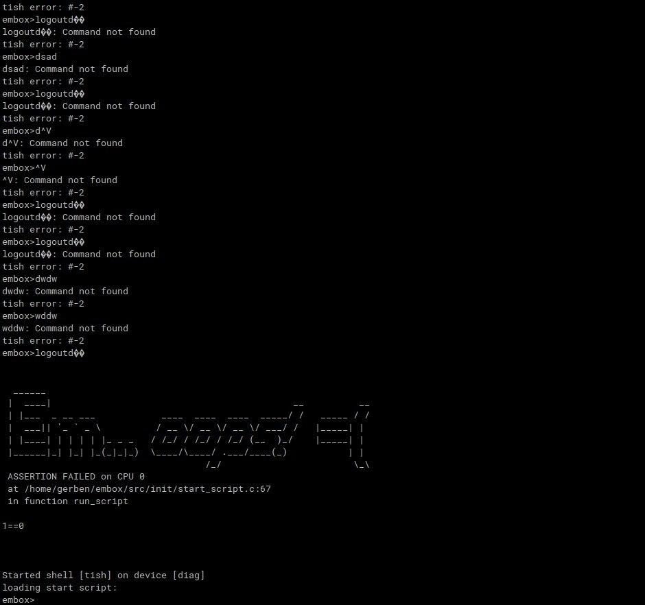
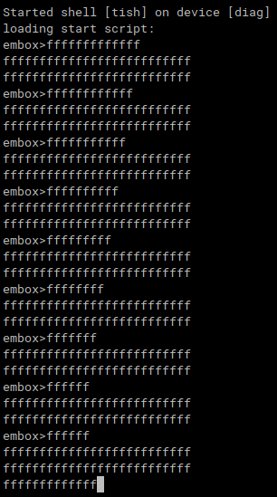

# При вводе достачно большой строки (например: ddddddddddddddddddddddddddddddddddddddddddddddddddddddddddddddddddddddddddddddddddddddddddddddddddddddddddddddddddddddddddddddddddddddddddddddddddddddddddddddddddddddddddddddddddddddddddddddddddddddddddddddddddddddddddddddddddddddddddddddddddddddddddddddddddddddddddddddddddddddddddddddddddddddddddddddddddddddddddddddddddddddddddddddddddddddddddddddddddddddddddddddddddddddddddddddddddddddddddddddddddddddddddddddddddddddddddddddddddddddddddddddddddddddddddddddddddddddddddddddddddddddddddddddddddddddddddddddddddddddddddddddddddddddddddddddddddddddddddddddddddddddddddddddddddddddddddddddddddddddddddddddddddddddd), а также выполнения дальнейших действий с ней (удаление некоторых символов или передвижения курсора) происходит гарантированное зависание системы.

# При первой отправке и некоторых последущих "logoutd��" система корректно отрабатывает, однако в конце концов при вводе этой последовательности система падает. Из-за чего и падает стабильность фаззинга.

# При вводе "fffffffffffff^Mfffffffffffff" (^M - новая строка) в терминал Embox через ctrl+shift+v в количестве трёх раз, не нажимая enter. Вы получаете это:

